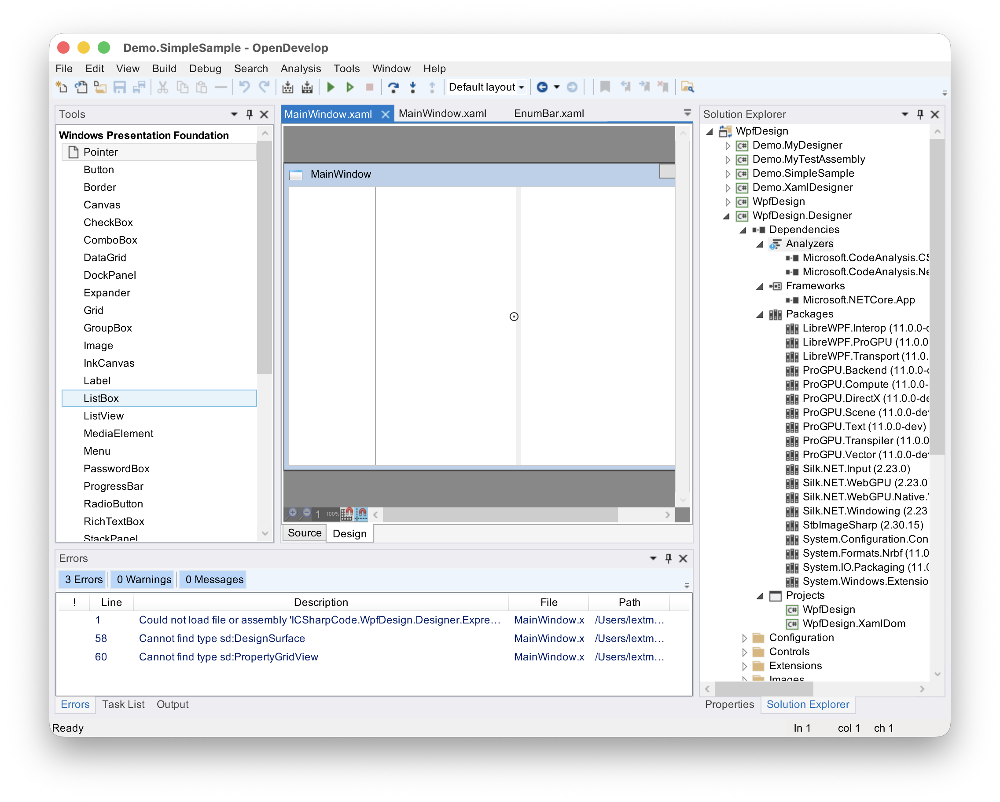
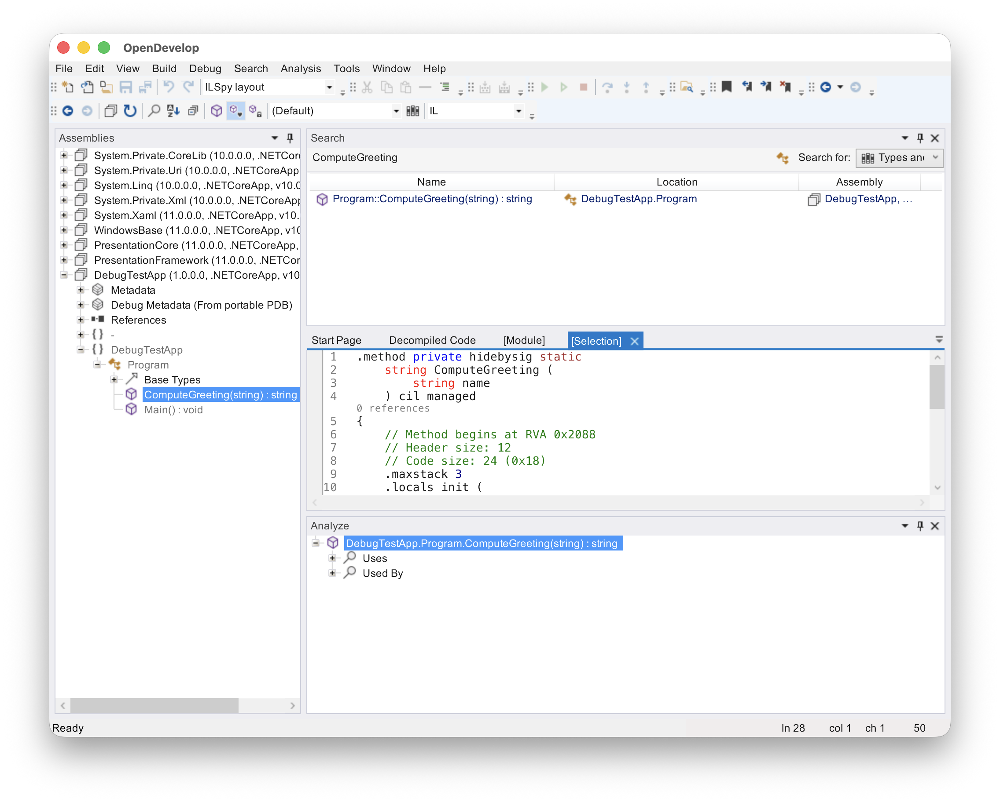
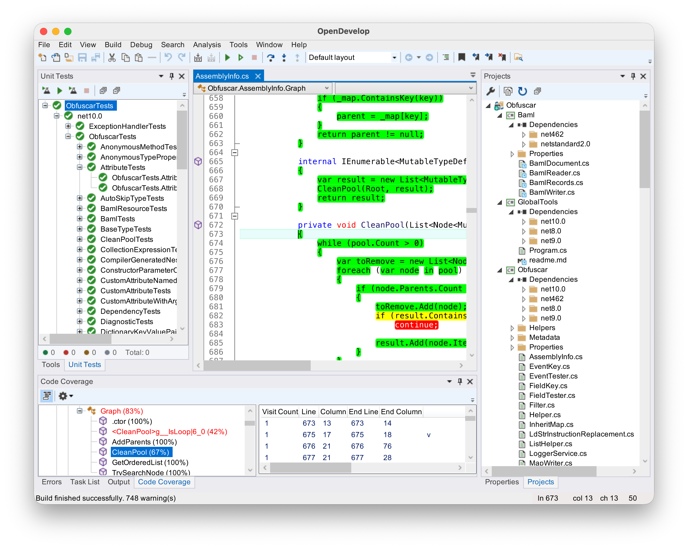
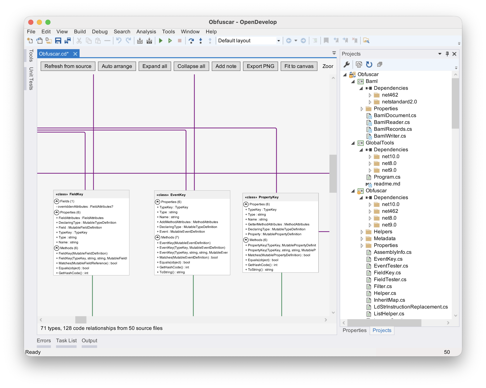

# OpenDevelop

OpenDevelop is an open-source Integrated Development Environment (IDE) for C# and the .NET
platform, a modern continuation of the classic SharpDevelop code base. It is written almost
entirely in C# and runs on .NET 10 via LibreWPF (the cross-platform, WPF-compatible runtime),
on Windows, macOS, and Linux.

## Screenshots



*WPF designer for editing XAML with a live preview.*



*ILSpy integration: browse assemblies and decompile types side by side in an embedded pane.*



*Code coverage results with per-method markers in the editor.*



*Class diagram designer for visualizing type hierarchies.*

## Overview

The SharpDevelop project started in 2000, initiated by Mike Krüger. OpenDevelop keeps
the original SharpDevelop v4/v5 architecture (the addin tree, the workbench, AvalonEdit, and the
project system) while moving it forward:

- **Cross-platform**: WPF UI on .NET 10 through LibreWPF; builds and runs on Windows, macOS, and Linux.
- **Modern project support**: SDK-style .NET projects and the new `.slnx`
  solution format.
- **ILSpy decompiler built in**: navigate assemblies and decompiled source in a dedicated
  pane with assembly-list, language, and language-version pickers, all bound to the hosted
  ILSpy workspace.
- **Semantic themes**: full Light and Dark themes for the entire shell — window chrome,
  menus, toolbars, status bar, scrollbars, grids, and dialogs follow one coherent palette
  and switch at runtime.
- **Extensible**: the classic addin tree makes it easy to add pads, commands, and tools.

## Features

- Code editor based on AvalonEdit with syntax highlighting, folding, bookmarks, and
  breakpoints.
- Solution explorer with per-node icons, overlays, and context actions.
- Debugger integration (breakpoints, locals, call stack) with SharpDbg.
- Class diagram generation and editing.
- WPF designer (XAML editing with preview).
- NuGet package management.
- Unit test support based on the Microsoft Testing Platform.
- Code coverage runner with editor markers with AltCover and coverlet.
- Start page with recent projects and quick open.

## Building & Running

Requirements: .NET 10 SDK.

### macOS

```sh
./launch.sh            # build OpenDevelop.Mvp.slnx and run
./launch.sh --no-build # run the last build output
./launch.sh --build-only
./rebuild-all.sh       # full rebuild of the app and its dependencies
./dist.macos.sh        # produce a distributable bundle
```

A `DEVFLOW_DISABLE=1` environment variable turns off the built-in DevFlow automation agent
(used by integration tests and interactive debugging through its HTTP API on `localhost:9299`).

## Solutions

| Solution | Purpose |
|---|---|
| `OpenDevelop.Mvp.slnx` | Main application solution |

## Tests

Unit and integration tests live in `tests/`. Integration tests drive the running IDE through
the DevFlow agent's UI/automation endpoints (`/api/v1/ui/*`), which allows verifying real
UI behavior (themes, menus, pads) deterministically.

## Libraries

- AvalonEdit — code editor
- AvalonDock — docking framework
- SharpTreeView — tree views
- [ILSpy](https://github.com/icsharpcode/ILSpy) — decompiler (hosted in-process)
- [LibreWPF — WPF-compatible runtime](https://github.com/wieslawsoltes/WPF) for .NET 10
- [NuGet](https://www.nuget.org/) — package management
- [Microsoft Testing Platform](https://github.com/microsoft/testfx) — unit testing
- [log4net](https://logging.apache.org/log4net/) — logging

## License

MIT

## Copyright

Copyright © 2002-2016 AlphaSierraPapa for the SharpDevelop team.
Copyright © 2026 LeXtudio Inc.
